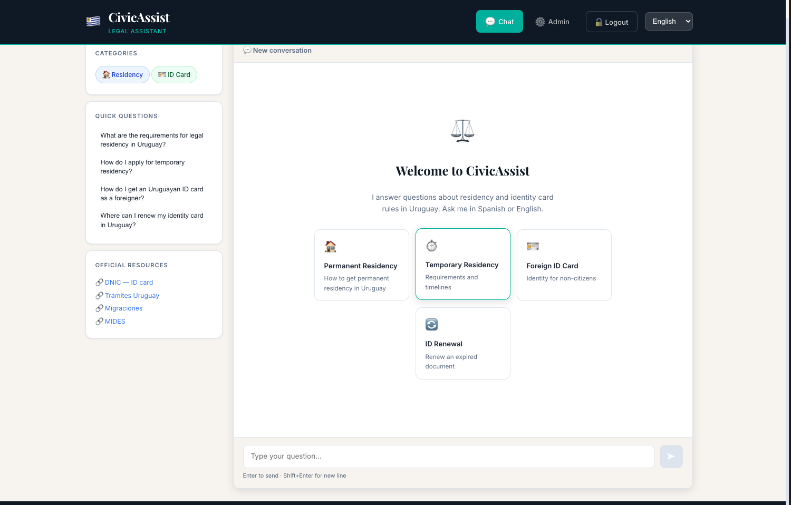
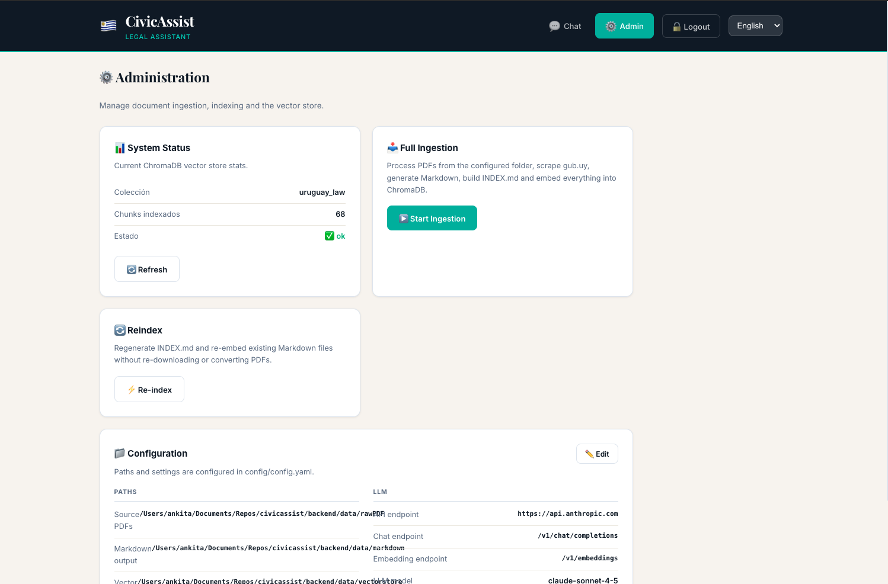

# CivicAssist — Asistente Legal / Legal Assistant

**CivicAssist** is a RAG-powered bilingual legal assistant for Uruguayan immigration and identity processes.
It supports Spanish and English, and answers questions using local knowledge from PDF and web sources.

**Docs:** [Vision](docs/VISION.md) · [Architecture](docs/ARCHITECTURE.md) · [User Guide](docs/USER_GUIDE.md)

## Screenshots

| Chat | Admin |
|------|-------|
|  |  |

## Key Features

- Question answering for Uruguayan:
  - **Residencia** (permanent, temporary, refugio, prórroga, cambio de categoría)
  - **Cédula de Identidad** (uruguayos, extranjeros, renovación, duplicado, primera vez)
- Retrieval-augmented generation (RAG) using ChromaDB
- Generic LLM integration with:
  - **Claude / Anthropic**
  - **OpenAI**
  - **On-prem or cloud Ollama**
- Admin UI for ingesting PDFs, scraping, reindexing, vector-store stats, and **live config editing**

---

## Architecture

```
┌─────────────────────────────────────────────────────┐
│                    Frontend (React)                  │
│  ChatPage · AdminPage · Sidebar · MessageBubbles     │
└──────────────────────────┬──────────────────────────┘
                           │ HTTP / REST
┌──────────────────────────▼──────────────────────────┐
│              Backend (FastAPI / Python)              │
│                                                      │
│  POST /api/v1/chat              → query.py           │
│  POST /api/v1/admin/ingest      → ingestion+scraper  │
│  POST /api/v1/admin/reindex     → indexer+vectorstore│
│  GET  /api/v1/admin/stats       → vectorstore stats  │
│  GET  /api/v1/admin/config      → runtime config     │
│  PUT  /api/v1/admin/config/llm  → update LLM config  │
│  PUT  /api/v1/admin/config/paths→ update path config │
│                                                      │
│  Services:                                           │
│  ├─ ingestion.py   PDF → Markdown                    │
│  ├─ scraper.py     gub.uy → Markdown                 │
│  ├─ indexer.py     → INDEX.md (decision tree)        │
│  ├─ vectorstore.py → ChromaDB embed / retrieve       │
│  ├─ llm.py         → LLM client abstraction          │
│  └─ query.py       classify → retrieve → LLM         │
└──────────────────────────────────────────────────────┘
                 │              │
       ChromaDB Local Vectors   Generic LLM API
```

---

## Requirements

- Python 3.10+
- Node.js 18+
- Git

---

## Quick Start

```bash
# 1. Configure environment (copy template, then add your LLM key)
cp .env.example backend/.env

# 2. Start the backend (creates venv + installs deps on first run)
./scripts/start_backend.sh          # Mac / Linux
# scripts\start_backend.bat         # Windows

# 3. In a second terminal, start the frontend
./scripts/start_frontend.sh         # Mac / Linux
# scripts\start_frontend.bat        # Windows
```

Then open **http://localhost:3000**.

> The repo ships with pre-ingested data (PDFs, scraped Markdown, and a ChromaDB
> vector store under `backend/data/`), so search works immediately. You only need
> to add an LLM key to get generated answers — see [Configuration](#configuration).
> Without a key the chat still returns relevant sources and replies
> **"No LLM connected"**.

## Manual Setup

### Backend

```bash
cd backend
python3 -m venv venv
source venv/bin/activate      # Linux / Mac
# venv\Scripts\activate       # Windows
pip install -r requirements.txt
python main.py                # serves on http://localhost:8000
```

### Frontend

```bash
cd frontend
npm install
npm run dev                    # serves on http://localhost:3000
```

---

## Configuration

All configuration lives in `config/config.yaml`. The LLM, paths, and admin sections can be edited either directly in the file or live through the **Admin panel** in the UI — changes are written back to `config.yaml` immediately without a server restart.

Example `config/config.yaml`:

```yaml
app:
  name: "CivicAssist - Asistente Legal"
  version: "1.0.0"
  debug: true

api:
  base_url: "http://localhost:8000"
  prefix: "/api/v1"
  cors_origins:
    - "http://localhost:3000"
    - "http://localhost:5173"

llm:
  api_endpoint: "https://api.anthropic.com"
  api_key: "${LLM_API_KEY}"
  model_name: "claude-sonnet-4-6"
  temperature: 0.2
  max_tokens: 2048
  chat_endpoint: "/v1/chat/completions"
  embedding_endpoint: "/v1/embeddings"

admin:
  username: "admin"
  password: "admin"

paths:
  raw_pdfs: "./backend/data/rawPDF"
  markdown_output: "./backend/data/markdown"
  vectorstore: "./backend/data/vectorstore"
  index_file: "./backend/data/markdown/INDEX.md"

chromadb:
  collection_name: "uruguay_law"
  persist_directory: "./backend/data/vectorstore"
  embedding_model: "all-MiniLM-L6-v2"
```

### Environment variable overrides

The backend reads these env vars and applies them on top of `config.yaml`:

| Variable | Config key |
|----------|-----------|
| `LLM_API_KEY` or `ANTHROPIC_API_KEY` | `llm.api_key` |
| `LLM_API_ENDPOINT` | `llm.api_endpoint` |
| `LLM_CHAT_ENDPOINT` | `llm.chat_endpoint` |
| `LLM_EMBEDDING_ENDPOINT` | `llm.embedding_endpoint` |
| `LLM_MODEL_NAME` | `llm.model_name` |
| `ADMIN_USERNAME` | `admin.username` |
| `ADMIN_PASSWORD` | `admin.password` |

A `.env` file in `backend/` is automatically loaded.

### Admin credentials

Credentials are set in `config/config.yaml` under the `admin` section. The frontend posts them to `POST /api/v1/admin/auth` and stores a Basic auth token in `localStorage` for subsequent requests.

---

## Configuring the LLM

The simplest way to connect an LLM is via **`backend/.env`** (copied from
[`.env.example`](.env.example)). These variables override `config.yaml` at
runtime — no need to edit YAML:

```bash
# backend/.env
LLM_API_KEY=sk-...                       # your provider key (leave empty = no LLM)
LLM_API_ENDPOINT=https://api.anthropic.com
LLM_MODEL_NAME=claude-sonnet-4-5
# LLM_CHAT_ENDPOINT=/v1/chat/completions # OpenAI-style providers only
```

The provider is auto-detected from `LLM_API_ENDPOINT`:

| Provider | `LLM_API_ENDPOINT` | Notes |
|----------|--------------------|-------|
| **Anthropic (Claude)** | `https://api.anthropic.com` | Uses the native `/v1/messages` API and `x-api-key` auth automatically |
| **OpenAI** | `https://api.openai.com` | Uses `/v1/chat/completions` and `Authorization: Bearer` |
| **Ollama** | `http://localhost:11434` | No API key required |

After changing `backend/.env`, restart the backend.

### No LLM connected

If `LLM_API_KEY` is empty, or the configured key/endpoint fails authentication
or is unreachable, the chat still retrieves relevant sources but the answer is
simply:

> **No LLM connected.** Configure an LLM provider (LLM_API_KEY and
> LLM_API_ENDPOINT) in backend/.env, then restart the backend to enable answers.

This lets you run and explore the app end-to-end without any API credentials.

---

## First Run — Ingest Data

1. Add your PDF files to `backend/data/rawPDF` (or update `paths.raw_pdfs` in the config).
2. Open the app and go to the **Admin** page.
3. Click **Iniciar Ingestión**.

This will:
- Convert PDFs to Markdown
- Scrape `gub.uy/tramites` for relevant pages
- Build `INDEX.md`
- Embed all content into ChromaDB

Then use the **Chat** page to ask questions.

---

## API Endpoints

| Method | Path | Auth | Description |
|--------|------|------|-------------|
| `POST` | `/api/v1/chat` | — | Send a question, receive an answer |
| `POST` | `/api/v1/admin/auth` | — | Validate admin credentials |
| `POST` | `/api/v1/admin/ingest` | Basic | Run full ingestion pipeline |
| `POST` | `/api/v1/admin/reindex` | Basic | Rebuild INDEX and re-embed from existing Markdown |
| `GET` | `/api/v1/admin/stats` | Basic | Vector store statistics |
| `GET` | `/api/v1/admin/config` | Basic | Current runtime configuration (LLM + paths) |
| `PUT` | `/api/v1/admin/config/llm` | Basic | Update LLM settings and persist to config.yaml |
| `PUT` | `/api/v1/admin/config/paths` | Basic | Update path settings and persist to config.yaml |

### Chat request body

```json
{
  "question": "¿Cómo obtengo la residencia permanente?",
  "conversation_history": [],
  "session_id": "optional-uuid",
  "language": "es"
}
```

---

## Admin Panel

The Admin page (requires login) provides:

| Card | What it does |
|------|-------------|
| **System Status** | Shows vector store collection name, chunk count, and health |
| **Full Ingest** | Runs the complete pipeline: PDF conversion, web scraping, indexing, and embedding |
| **Reindex** | Rebuilds `INDEX.md` and re-embeds from existing Markdown without re-scraping |
| **Configuration** | Displays and edits all settings (paths and LLM) with live save to `config.yaml` |

The Configuration card has an **Edit** button that switches to an inline form. LLM API key is masked by default. Saving writes changes to `config.yaml` and reloads the backend singleton — no restart needed.

---

## Project Structure

```
lawassist/
├── config/
│   └── config.yaml
├── backend/
│   ├── main.py                  ← uvicorn entry point
│   ├── requirements.txt
│   ├── .env                     ← optional env overrides (gitignored)
│   ├── app/
│   │   ├── core/config.py       ← settings loader
│   │   ├── api/
│   │   │   ├── chat.py
│   │   │   └── admin.py
│   │   ├── models/schemas.py
│   │   └── services/
│   │       ├── ingestion.py
│   │       ├── scraper.py
│   │       ├── indexer.py
│   │       ├── vectorstore.py
│   │       ├── llm.py
│   │       └── query.py
│   └── data/
│       ├── rawPDF/              ← drop PDFs here
│       ├── markdown/
│       └── vectorstore/
└── frontend/
    ├── index.html
    ├── package.json
    └── src/
        ├── App.jsx
        ├── i18n.js
        ├── pages/
        │   ├── ChatPage.jsx
        │   └── AdminPage.jsx
        ├── hooks/useChat.js
        ├── utils/api.js
        └── styles/globals.css
```

---

## Disclaimer

> This application provides legal information for **orientation purposes only**.
> It is not legal advice. Always consult the competent Uruguayan authorities:
> [DNIC](https://www.dnic.gub.uy) · [Migraciones](https://www.migracion.gub.uy) · [gub.uy](https://www.gub.uy/tramites)
